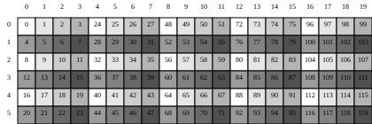
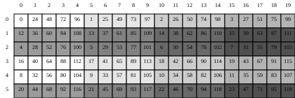
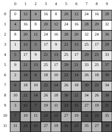

# Layout Algreba Samples

## $(4,8):(20,2)\otimes (3,2):(2,1) $

```
logical_product(Layout((4,8),(20,2)),Layout((3,2),(2,1)))=((4, 8), (3, 2)):((20, 2), (80, 1))
```

$A \otimes B := (A, A^* \circ B)$

From `cutlass/include/cute/layout.hpp`
```C++
//
// Logical product
//

template <class LShape, class LStride,
          class TShape, class TStride>
CUTE_HOST_DEVICE constexpr
auto
logical_product(Layout<LShape,LStride> const& block,
                Layout<TShape,TStride> const& tiler)
{
  return make_layout(block, composition(complement(block, size(block)*cosize(tiler)), tiler));
}
```

最大的问题是complement(A,M), 这里已经很清楚了`size(A)*cosize(B)` 

## blocked\_product 和 raked\_product 的理解

### 起点：logical\_product

论文中的例子 (Section 3.5.1 "Related Products"):

$A = (3,4):(4,1)$ (row-major tile), $B = (2,5):(1,2)$ (col-major grid)

```
logical_product(Layout((3,4),(4,1)), Layout((2,5),(1,2))) = ((3, 4), (2, 5)):((4, 1), (12, 24))
```

#### 推导过程

**Step 1: 计算 cotarget**

$\text{size}(A) = 3 \times 4 = 12$

$\text{cosize}(B) = (2-1) \times 1 + (5-1) \times 2 + 1 = 1 + 8 + 1 = 10$

$\text{cotarget} = 12 \times 10 = 120$

**Step 2: complement((3,4):(4,1), 120)**

filter 后不变（无 stride-0 或 size-1 mode）。按 stride 排序: `[(4,1), (3,4)]`

fold（R=2, 迭代 R-1=1 次）:

init: `shape=(4,3), stride=(1,4), result_shape=(), result_stride=(1)`

迭代 i=0: min\_stride=1, min\_idx=0 (shape=4, stride=1)
- `new_shape = 1 / 1 = 1` → size-1，coalesce 掉
- `new_stride = 1 × 4 = 4`
- result\_stride 更新为 `(1, 4)`

最后一个 mode (stride=4, shape=3):
- `new_shape = 4 / 4 = 1` → size-1，coalesce 掉
- `new_stride = 4 × 3 = 12`
- `rest_shape = ceil_div(120, 12) = 10`
- `rest_stride = 12`

$(3,4):(4,1)$ 是紧凑 layout（size = cosize = 12），所有内部 gap 都是 1，complement 只有 rest 部分：

$$A^* = \text{complement}((3,4):(4,1), 120) = 10:12$$

直觉：$A$ 占据 $[0, 12)$ 的每一个位置，complement 从 stride 12 开始向外扩展，给 grid 留出 10 个不重叠的偏移量。

**Step 3: composition(10:12, (2,5):(1,2))**

$A^*$ 是 rank-1 layout `10:12`，$B$ 是 rank-2 layout `(2,5):(1,2)`。

composition 对 RHS tuple 右分配：
- mode 0: `composition_impl(10, 12, 2, 1)` → lhs\_shape 是 integral → `2:(1×12)` = `2:12`
- mode 1: `composition_impl(10, 12, 5, 2)` → lhs\_shape 是 integral → `5:(2×12)` = `5:24`

$$A^* \circ B = (2, 5):(12, 24)$$

**Step 4: 组装**

$$A \otimes B = (A,\; A^* \circ B) = ((3,4),\;(2,5)):((4,1),\;(12,24))$$

logical\_product 的结果是 rank-2 layout：
- mode-0 (tile): `(3,4):(4,1)` — 原始 tile，不变
- mode-1 (grid): `(2,5):(12,24)` — tile 在 codomain 中的重复方式

这个 rank-2 结构把 "tile内坐标" 和 "tile间坐标" 分开了，但还没有合并成我们直觉上期待的 6×20 shape。

### blocked\_product：按 mode 对齐 zip

From `cutlass/include/cute/layout.hpp`:
```C++
blocked_product(block, tiler) {
  constexpr int R = max(rank(block), rank(tiler));
  auto result = logical_product(append<R>(block), append<R>(tiler));
  return zip(get<0>(result), get<1>(result));
}
```

blocked\_product 在 logical\_product 之上做一件事：**把 tile 和 grid 的对应 mode zip 在一起**。

$$\text{blocked\_product}(A, B) = \text{zip}(\text{mode-0}, \text{mode-1}) \text{ of } (A \otimes B)$$

对于我们的例子：
```
logical_product 结果 = ((3, 4), (2, 5)):((4, 1), (12, 24))
                        mode-0    mode-1
```

zip 把**同维度的 tile mode 和 grid mode 配对**：
- row 维度: tile 的 `3:4` 和 grid 的 `2:12` zip → `(3,2):(4,12)`
- col 维度: tile 的 `4:1` 和 grid 的 `5:24` zip → `(4,5):(1,24)`

```
blocked_product = ((3, 2), (4, 5)):((4, 12), (1, 24))
```

这是一个 6×20 的 layout（`3×2=6`, `4×5=20`），其中**每个 3×4 的 block 是连续的**——先走完一个 tile 内的元素，再跳到下一个 tile。这就是 "blocked" 的含义：tile 的元素在结果中聚集成块。



### raked\_product：反向 zip

```C++
raked_product(block, tiler) {
  constexpr int R = max(rank(block), rank(tiler));
  auto result = logical_product(append<R>(block), append<R>(tiler));
  return zip(get<1>(result), get<0>(result));  // 注意：顺序反了！
}
```

raked\_product 和 blocked\_product 的唯一区别：**zip 的顺序反转**——grid 在前，tile 在后。

$$\text{raked\_product}(A, B) = \text{zip}(\text{mode-1}, \text{mode-0}) \text{ of } (A \otimes B)$$

```
logical_product 结果 = ((3, 4), (2, 5)):((4, 1), (12, 24))
                        mode-0    mode-1
```

反向 zip：
- row 维度: grid 的 `2:12` 和 tile 的 `3:4` zip → `(2,3):(12,4)`
- col 维度: grid 的 `5:24` 和 tile 的 `4:1` zip → `(5,4):(24,1)`

```
raked_product = ((2, 3), (5, 4)):((12, 4), (24, 1))
```

同样是 6×20 的 layout，但 tile 的元素是**交错散布**的——先跨 tile 跳一步，再回到 tile 内。这就是 "raked"（耙过）的含义：就像用耙子把 tile 的元素均匀撒在整个结果中。



### 对比总结

| | blocked\_product | raked\_product |
|---|---|---|
| zip 顺序 | `zip(tile, grid)` | `zip(grid, tile)` |
| 结果 shape | `((3,2),(4,5))` | `((2,3),(5,4))` |
| 结果 stride | `((4,12),(1,24))` | `((12,4),(24,1))` |
| 遍历特征 | 先走完 tile 内部，再跳到下一个 tile | 先跨 tile 走一步，再回到 tile 内部 |
| 直觉 | 每个 3×4 block 是连续的 | 3×4 tile 的元素均匀散布在 6×20 中 |

核心洞察：blocked\_product 和 raked\_product **共享同一个 logical\_product**，它们只是对结果的 mode 做了不同方向的 zip。logical\_product 是真正的代数操作（complement + composition），blocked/raked 只是 mode 重排。

### 附：logical\_divide

logical\_divide 是 logical\_product 的对偶操作——product 是"用 B 的形状重复 A"，divide 是"用 B 的形状切分 A"：

$$A \oslash B = A \circ (B,\; B^*_{|A|})$$

