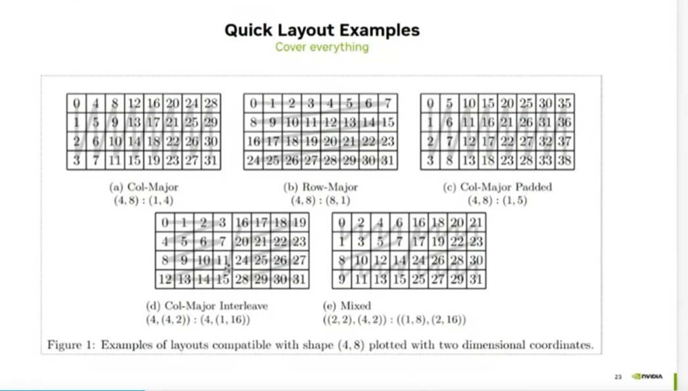

## quick layout examples




(d) Col-Major Interleave
(4,(4,2)):(4,(1,16)) 
我们把(4,2):(1,16)看成一个压平的列（1d）

```
+----+----+
|  0 | 16 |
+----+----+
|  1 | 17 |
+----+----+
|  2 | 18 |
+----+----+
|  3 | 19 |
+----+----+
```
然后拉平 
0 1 2 3 16 17 18 19
然后在行维度叠加 stride = 4
就是图上那个样子

(e) Mixed
((2,2),(4,2)):((1,8),(2,16))

(2,2):(1,8)是行
(4,2):(2,16)是列

呈现这样
```
+----+
|  0 | 
+----+
|  1 | 
+----+-
|  8 |
+----+
|  9 | 
+----+
```

```
+----+
|  2 | 
+----+
|  3 | 
+----+-
|  10|
+----+
|  11| 
+----+
```
列是
(4,2)：(2,16)再次拉平
0 2 4 6 16 18 20 21
所以也就是图上那个样子
